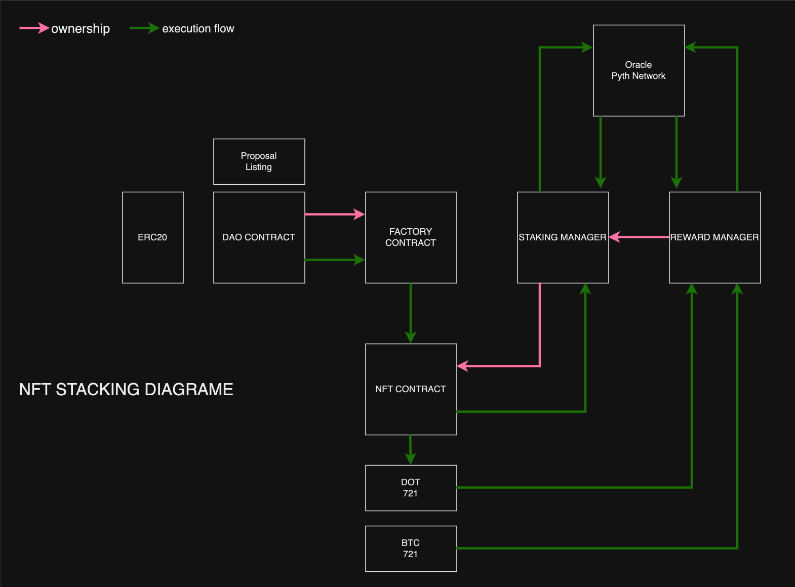

# NFT_DAPP_STAKING



Protocole NFT Finance Staking Pools (NFSP)
==============

# Introduction
Le Protocole NFT Finance Staking Pools (NFSP) est une solution décentralisée innovante qui combine des NFTs représentant des actifs cryptographiques, des mécanismes de staking DeFi, et des périodes de contrats à terme pour offrir aux utilisateurs un moyen compétitif et transparent de générer des rendements.

Les utilisateurs achètent des NFTs représentant des actifs, et les fonds collectés sont stakés dans des protocoles DeFi éprouvés pour générer des récompenses. Les rendements sont distribués en fonction de la performance des actifs et de la proportion de NFTs dans chaque pool.

# Fonctionnalités
## NFTs Représentant des Actifs Cryptographiques :

Chaque NFT représente un actif sous-jacent (par exemple, BTC, ETH, LINK).
Les utilisateurs achètent ces NFTs pour accéder aux pools de staking.
Pools de Staking avec Contrats à Terme :

Différentes périodes de lock-up sont disponibles : 1 mois, 3 mois et 6 mois.
Les fonds sont stakés dans des protocoles DeFi comme Aave, Compound ou Yearn Finance.
Récompenses Basées sur la Performance :

Les récompenses sont calculées selon la performance des actifs sous-jacents et la proportion de NFTs dans le pool.
Les actifs les plus performants reçoivent une plus grande part des récompenses.
Modèle de Frais Durable :

Un frais de 10 % est prélevé sur les récompenses générées pour assurer la durabilité du protocole.

# Calcul des Récompenses
## Les récompenses sont calculées de la manière suivante :

```js
Ri = (ΔPi / Σ ΔPj) * (1 / Ni) * (1 - 0.10)
```
* Ri : Récompense pour le NFT i.
* ΔPi : Variation du prix de l'actif i pendant la période de staking.
* Ni : Nombre de NFTs représentant l'actif i.
* 10 % de frais sont prélevés pour soutenir l'infrastructure du protocole.

# Exemple de Fonctionnement

Cas avec 5 utilisateurs et 5 actifs :
Chaque utilisateur stake 100 DAI pour un total de 500 DAI.
Après 3 mois, les performances des actifs sont les suivantes :

* BTC : +10 %, 
* ETH : +5 %, 
* LINK : +2 %, 
* ADA : -1 %, 
* DOT : +12 %

Les récompenses après frais (22,5 DAI) sont réparties proportionnellement à la performance des actifs.

# Avantages du Protocole

* Compétition basée sur la performance : Les rendements sont directement influencés par la performance des actifs.
* Sécurité : Utilisation de protocoles DeFi éprouvés pour le staking.
* Diversité stratégique : Plusieurs périodes de lock-up pour s'adapter aux stratégies d'investissement.
* Transparence totale : Intégration avec The Graph pour suivre en temps réel les performances et les proportions des NFTs dans chaque pool.

# Roadmap

* Phase 1 : Développement et lancement du testnet avec les actifs cryptographiques populaires (BTC, ETH, etc.).
* Phase 2 : Intégration de The Graph pour la transparence et la traçabilité des données.
* Phase 3 : Lancement sur mainnet avec une base d'utilisateurs élargie.
* Phase 4 : Introduction de nouveaux actifs financiers tokenisés (actions,matières premières).

# Installation et Déploiement

Install
```bash
npm install
```
Déployez les contrats sur un testnet :

```bash

npx hardhat run scripts/deploy.js --network rinkeby
```
Testez le protocole localement :

```bash

npx hardhat test
```

# Contributeurs

# License
Ce projet est sous licence MIT. Voir le fichier LICENSE pour plus d'informations